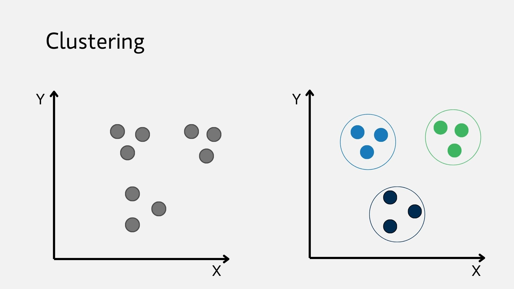
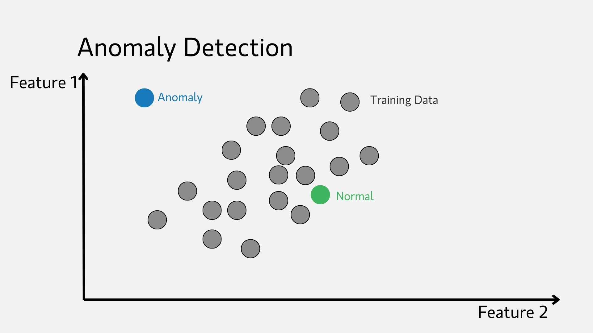
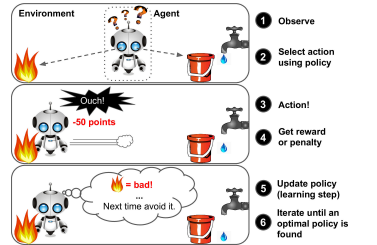
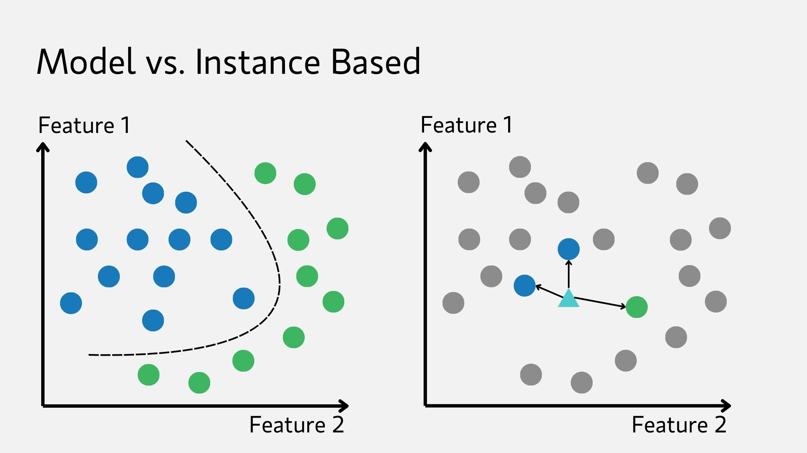

# What is AI really?

## Intro

AI is capturing everybody’s imagination but very few people can tell you how it really works. This article is my humble attempt to help you look smarter when talking about the subject.

Grab a coffee and get ready. The article will avoid getting too technical but still give enough context.

Machine learning, simply put, is computers using fancy math techniques to get better at doing a task instead of having a human explicitly telling it how to do it.

The magic of AI is not really magic. Engineers create machines that can measure how well they performed on a task. These machines will then try to repeat the process many times and figure out how to make less and less errors.

Think of someone shooting an arrow. The first one hits a little left of the bullseye so on the next try they will aim a little more to the right.

Machines do the same using something called a **loss function**, a measure of accuracy of their prediction. The machine will adjust a little at each try, in AI jargon this is called a **learning rate**.

## Examples of Machine Learning applications

Machine learning has existed for decades now and some of the technologies that we take for granted are actually using AI already.

A common task is image classification. In hospitals, radiology scanners use ML to detect if a scan image contains a tumor. This uses Convolutional Neural Networks which scan the pixels of an image as groups and identify patterns in them.

Another task is text classification. Your email service can detect if an incoming email resembles other emails that were previously flagged as spam. If the similarity score is above a threshold, that email will automatically get sent to the spam bucket. Natural Language Processing is used to interpret the text of an email and this is done using Recurrent Neural Networks.

Recurrent Neural Networks, (aka RNN) interpret text units (words and subwords) as numbers called tokens, The process of converting words into tokens is called tokenization. This creates an embedding for each word which are high dimensional vectors.

The logical relation between words comes from the distance between their embeddings. For example the words “dog” & “cat” have vectors that are closer to each other than “car” or “banana”.

ML has many other applications such as figuring out which items look most similar to each other, aka clustering. A common occurance of this technique is in social media platforms. That is how tik-tok realized you’re one of those people that like baking videos, you behave a lot like all the people that previously liked baking videos.

The inverse of clustering is anomaly detection, how dissimilar is something to what the model has been trained on. This is what powers fraud prevention bots. Think of the last time you tried using your credit card in a new country when traveling or trying to buy something more expensive than usual.

Finally, a notable type of ML applications are game bots. Most of us played video games against non-human players. Have you ever wondered how they understood the game and got good at it? That’s because they’ve been trained using Reinforcement Learning where a machine makes sequential decisions and tries to maximize its reward (in this example, the game score). The machine thus learns with time which actions lead it to higher scores and that is called its policy

## Types of machine learning

### Learning Mode

ML algorithms can be classified a few different ways.
The first relates to how the model is trained. The four major buckets are:

1. supervised
2. unsupervised
3. semi-supervised
4. reinforcement

#### Supervised Learning

The data provided to the mode during training contains the correct answer ahead of time. These are called **labels** and the model will compare its prediction to the truth value of the label and try to minimize its **error rate**.

Neural network learning happens by repeating a two step process until a satisfactory error rate is reached. These two steps are called:

1. Forward propagation
2. Backwards propagation

Forward propagation is the process of running computations through the neural network from input to output and then finally comparing the prediction to the truth value of the label.

Backwards propagation is the process of incrementally updating the parameters of the network, backwards from output to input. This is what allows the model to optimize its parameters and lower its error rate.

Each successive forward and backwards pass allows the model to try a prediction, judge its accuracy and then update its parameters in order to have better predictions on the next run.

#### Unsupervised

The opposite of supervised learning. The training data is provided with no labels and the machine will use various techniques to group instances in buckets of similarity.

For example a clustering algorithm will group users
of an application such as youtube by the channels that they listen to. The algorithm will automatically be able to pick up on people with varying interests (cat videos, DIY videos, etc) without the need for a human to label the instances.

That is the basis of how the Youtube/Netflix recommendations systems can find videos/series that you may want to watch with very good accuracy.

#### Semi-supervised Learning

Semi-supervised learning was developed to take advantage of the best of both worlds. Labeling data is often time consuming while unlabeled data is harder to work with. Some algorithms can deal with data that is partially labeled.

Take for example the photo application on your phone. Nowadays the application can find all pictures showing the same person even though it may not know their name. However if the user labels one (or a few pictures) of the same person, the application is able to label all the pictures in the catalog that show this person.

This is the same technology that underlies the Facebook album algorithm where you can tag one of your friends once but the next time you upload a picture of that person, Facebook can predict and recommend that you tag them automatically.

#### Reinforcement Learning

Reinforcement learning is when a machine (called an **agent**) is given a reward/punishment function and is allowed to take actions in a given situation.

The machine would observe the impact of its actions on the reward function score and update its **policy** accordingly. This technique allows the machine to learn the rules of the **game** through discovery.

Reinforcement learning can pit two machines against one another and through that process both machines become better players of the game (think go or chess)

#### Online vs Offline Learning

The ability of a machine to keep learning incrementally from new experiences is what distinguishes batch from online learning.

In batch learning the machine is trained on a set of data and once it is deployed it does not reflect upon the accuracy of its prediction or improve from them.

In cases where you want your machine to react to changing circumstances and scenarios that it may not have encountered during training is to feed it data instances sequentially. This is called **mini-batches**. The upside here is that the learning step is faster and the system can learn as new data comes in.

### Instance based vs model based

Finally ML models can be classified as either instance based or model based.

Instance based models compare incoming to data examples that exist already in their training sets.  It will try to correlate the new observation to instances in its training set that most closely resemble it.

On the other hand model based applications derive a model of the world from their training and attempt to predict/classify the new instances that they encounter into “regions” that they learned.

## Challenges in runnin AI models

### Insufficient Data

A human will learn to drive with 20 hours of personal experience behind the wheel. Tesla has still to achieve this capability even though it fed its models millions and billions of hours of recorded driving. Why is that?

The honest answer is: we don’t yet know. Humans are able to process and learn from a much smaller set of data.

Under this current constraint, ML models need a lot of data to produce good predictions. This makes the collection of good quality data in sufficient quantity a challenge.

#### Nonrepresenetative Data

If a training dataset is missing examples about an important part of the population it will not generalize well.

Imagine a dataset of dog and cat pictures, if no images of chihuahuas are present then the model may predict images of chihuahuas as very angry cats with pointy faces (an understandable mistake that any of us can make)

#### Poor Quality Data

Training data may contain a lot of noise, errors and outliers. These will skew the learning accuracy and degrade prediction quality.

Practitioners spend lots of time cleaning data. This can be the removal of outliers, the averaging out of missing data or the removal of instances that contain errors or missing data.

#### Irrelevant Features

Garbage-in, garbage out. That is the motto.

In cases where the input data contains irrelevant features ML engineers would resort to either selecting the most useful features and dropping the rest (feature selection) or combining features to increase usefulness (feature extraction).

Consider a model that predicts life satisfaction scores of countries. It may generalize from country names such as Switzerland, Norway, New Zealand & Sweden that the letter “w” in the name has predictive value about life satisfaction. That model will of course have very bad predictions if it is asked about Zimbabwe or Rwanda.

### Overfitting

A fancy way of saying “overgeneralizing”. The model would be very good at fitting the training data but not generalize well.

This happens when the model is too complex compared to the size and noisiness of the training data, the model will pick up on patterns within the noise itself that is not necessarily present in the general case.

You can either simplify the model, get more data, reduce the noise in the data (cleanup) or use regularization techniques.

**Regularization** methods introduce penalties on the model if it overfits. This is done by:

- L1 & L2 regularization: preventing models relying too much on a few parameter

- Dropout: randomly exclude some nodes of a neural network from some training runs so as to discourage co-adaptations

- Early stopping: monitoring performance during training and stopping the training process when performance starts degrading

## Testing and validating

**Hyper-parameters** are values that are left unchanged by the training process (such as the learning rate among others). The choice of these values has a lot of impact on the performance of models.

For example a learning rate that is too big would lead to erratic performance and maybe the inability of the model to minimize its error rate. A learning rate that is too small on the other hand may lead to much longer training periods (which cost a lot in time, money and compute).

Optimizing hyper-parameters is called fine-tuning. A mistake that often occurs is training multiple models, each with its own set of hyperparameters, and choosing the model with the lowest error rate. This generally would lead to poor generalization because the hyper-parameters were optimized for this particular set of training data but not the general population.

A solution is **holdout validation**, keeping a subset of the data outside of training and evaluating candidate models on this data, called **validation set**, that none of them have previously seen.

Finding the right proportion of the dataset to allocate to the validation set is more of an art than science. The more data you have, the validation can make up a smaller proportion of the data.

If the validation set is too small the evaluation of the model could be inaccurate. If the validation set is too large, then you may have trained the model on too little data.

## Conclusion

Overall we’ve covered, on a high level, the landscape of modern machine learning. We’ve seen that ML models can serve a multitude of applications and can be categorized by how they learn, predict or get deployed.
