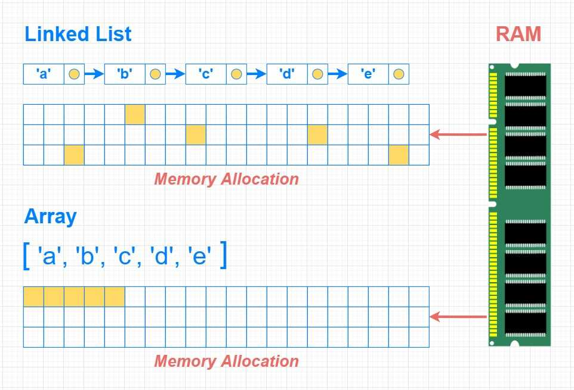
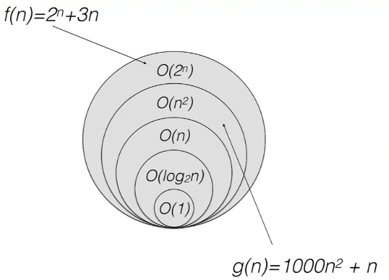

# Algorithms and Data Structures 1

## Course Topics

1. Problems, Algorithms and Flowchart
2. Pseudocode
3. Vectors, Stacks and Queues
4. Arrays, Linked Lists and Searching Algorithms (part 1)
5. Sorting Algorithms (part 1)
6. Evaluating Algorithms
7. Searching Algorithms (part 2)
8. Recursion
9. Sorting Algorithms (part 2)
10. Computational Complexity

## Topic 1: Problems, Algorithms and Flowchart

Key Concepts:

- Algorithms
- Flowcharts

Key Takeaways:

- Problems in computing need to be defined in logical/mathematical forms (Should I take a holiday? vs How many days of holidays is there?)
- Problems can have multiple solutions
- The solutions are called algorithms. Sets of step-by-step instructions to solve a problem.
- Algorithms can be adapted to solve similar problems.
- Judging which algorithms (solutions) are best for solvig a problems is a central aspect of algorithm design.

An exmaple problem would be: If $x^2 = 2$, is x an integer? We can propose two solutions:

1. Compute $\sqrt{2}$ and verify if its an integer
2. For all integers less that 2, compute $x^2$ and see if it equals 2.

Which solution to choose? Is there a better solution? Is there a solution that would also solve the case $x^2 = 1621$?

### History of algorithms

Algorithms predate computers and can be defined and solved without them.

The word algorithm traces its root to the persian mathematician Al-Khawarizmi (9th century) who discovered a method to solve quadratic equations.

Euclid (300 BCE) created and alogrithm to find the greatest common divisor of two numbers.

### Converting mathematics to digital representations.

Whole and rational numbers (integers and fractions) can be stored in finite numbers of computer memory cells. The later represented as the division of two integers. But how do we represent irrational numbers, such as $\pi$, which extend infinitley after the decimal?

In such cases we use approximation where the difference between the irrational and rational number is less than a small arbitrary threshold $\eta$ which is called the **precision** of calculation. The smaller the value $\eta$ the more precise.

$$
|\pi -\frac{a}{b} \le \eta
$$

### Calculating square roots: Heron's method

One of the earliest know algorithms, created by Heron of Alexandria in order to approximate the square root of a number.

It consists of taking an initial candidate $x_0$ that may be the square root of $X$ such as $X=x_0^2$

If the above formula doesn't hold for a desired level of precision we take $x_1$ as the average of $X$ and $x_0$. We keep iterating untill we reach a number $x_n$ that satisfies the equation.

$$
x_{n+1}=\frac{1}{2}*(x_n+\frac{X}{x_n})
$$

The intuition behind this is that if $x_n$ is an overestimate of $\sqrt{X}$ then $\frac{X}{x_n}$ will be an underestimate. The average of the two would be closer to the true value of $\sqrt{X}$. As we rerun the steps for $n=1,2,3,4....$ we have the difference between the candidate value and true value getting smaller, untill it id under the threshold.

$$
arrow|\sqrt{X} - x_n | \le \eta
$$

### Flowcharts

Flowcharts are graphincal representation of series of events, decisions and computations. They are useful for modeling the flow of execution of an algorithm.

UML (Universal Modelling Language) is a standard way of representing systems designs in many industries, not just software (e.g: manufacturing).

[UML Wikipedia Page](https://en.wikipedia.org/wiki/Unified_Modeling_Language)

#### Flowchart component types

- Start & end states (terminals)
  - oval shapes
- I/O actions
  - paralelogram shapes
  - represents gathering or displaying data
- Control flows
  - Arrows between states/actions
- Decisions
  - diamond shapes
  - Multiple branches lead out in different directions, depending on choice. Typically YES/NO choices.
- Basic actions
  - Runs computation, send request

:::{mermaid}
flowchart TD
id1(Start - enter room) --> id2[/Action - check light/]
id2 --> id3{Decision - Is it dark?}
id3 -- Yes --> id4[Action - Turn on light]
id3 -- CHOICE 1 --> id5[Action - Sit down]
id5 --> id2
:::

#### Heron's method as a flowchart

Compute square root of integer X up to n.d.p

:::{mermaid}
flowchart TD
id1(Start) --> id2[/Get X,n/]
id2 --> id3["Make guess g of sqrt(X)"]
id3 --> id4[Calculate X/g]
id4 --> id5{Does X/g differ from g up to n.d.p?}
id5 -- NO --> id6[Output g]
id6 --> id7(Stop)
id5 -- YES --> id8["Calculate average(X/g, g)"]
id8 --> id9["set g=average(X/g, g)"]
id9 --> id4
:::

### Euclid's algorithm as a flowchart

You have 48 toys and 42 sweets to distribute to guests at a child birthday party. The goal is to equaly distribute all the sweets and toys to the maximum number of people. How would you go about solving this problem.

This is a case of looking for the greatest common divisor for both sweets and toys. This number would be the solution to how many people you can invite and how many sweets/toys each will get.

This is a generalisable problem for ressource allocation. Euclid proposed an algotihm to find the GCD over 2000 years ago. It goes like this:

:::{mermaid}
flowchart TD
t1(Start) --> s1{Is A=B}
s1 -- YES --> s2[Output A]
s2 --> t2
s3 --> YES --> s4[Set A = A-B]
s1 -- NO --> s3{Is A>B}
s3 --> NO --> s5[Set B = B-A]
s4 & s5 --> s1
t2(End)
:::

Intuitivly, if the larger number divided by the second has no remainder then the division result is a common divisor.

Untill the two number are not equal, repplace larger number with remainder and repeat untill both numbers are equal in wich case that is the GCD.

Mathmatically it can be explained as such. If $A = B+C$, then $A \mod  N \equiv (B \mod N )+ (C \mod N)$.

We know that $A = B * quotient + R$ and thus a common divisor G for A & B is also divides A & R.

We use this logic to keep repeating untill we find a division that has no remainder which is the GCD.

## Topic 2: Pseudocode

Key Concepts:

- Pseudocode
- Iteration

Flowchart are limited because they are continuous processes while algorithms operate in discrete steps. Flowchart provide a usefull starting point but we need a tool that take this into account. This is where pseudocode comes into the picture.

Pseudocode is a way to write algorithm in plain language that is independent of which programing language or machine you are using.

### Pseudocode Notation

There are common standards to notation:

- Assignment operator: $\leftarrow$
  - e.: assign the value 2 to the variable x : $x  \leftarrow 2$
- Variable name contain have spaces
  - e.g: VariableName (correct), varible_3 (correct), Variable Name(incorrect)
- Written from left to right, top to bottom
- Variables can be self referencial
- Arithmetic: $+ - * /$
- Comaprison: $= \ne \le \ge > <$
- Flow control blocks are indented.
- Logic under If, While & For loop blocks are indented
  - If statement start with "If condition then" and end with "end if"

### Functions

A general concept but in computer science its am encolsed set of logic that takes input and returns output.

#### Example Function

The below function would check if a number is even or odd.

```bash
function Even(n)
  if n mode 2 = 0
    return TRUE
  else
    return FALSE
  end if
end function
```

### Iteration

Iteration is the process of repeating a set of steps multiple times untill a condition is met. When the condition is met you "break" out of the repeating loop and move on to the subsequent set of intructions.

They are also called "loops" and in flowchart representation you can see that by following the arrows forming a loops such as the below chart:

:::{mermaid}
flowchart LR
t1(Start) --> s1 --> s2 --> s3 -- LOOP --> t1
:::

There are two type of loops, "For Loops" and "While Loops".

- "For loops" iterate over specific number of steps, predefined at the top.

```bash
x <-- 1
for 2 < i < 10 do
  x <-- x + 1
end for
```

- "While Loops" iterate untill a condition is met. The execution of the code in the loop will modify values that the "While loop" will examin at the start of each iteration.

```bash
x <-- 1
while x < 10 do
  x <-- x + 1
end while
```

#### Extended loop behaviors: break & continue

During execution we can stop iterating early, if a certain condition has been met, using break statements. In the below example we return y = 5 and not y = 10 because we **break out** of the loop when i = 5, which stop us from iterating further up to 10.

```bash
function TestBreak()
  for i <= 10 do
    y <-- i
    if i = 5 then
      break
    end if
  end for
  return y

TestBreak()
5
```

We can also skip some iterations of the loop and restart at the next iteration using **continue**. In the below example we skip over the execution of a loop if i is even, thus only printing out the odd numbers in the array.

```bash
function TestContinue()
  for i <= 10 do
    if i mod 2 = 0 then
      continue
    else
      print(i)
    end if
  end for

TestContinue()
1,3,5,7,9
```

#### Challenge: Solving a problem with iteration

Problem: If $x^2 = n$, is x an integer?

Our solution would be to start with the first integer, 1, and iterate untill n. If any of the integers x from 1 to n satisfy $x^2 = n$, output true, otherwise output false.

```bash
function IsXInteger(n)
  y <-- FALSE
  for 1 <= i <=n do
    if i*i = n then
      y <-- TRUE
      break
    end if
  end for
  return y
end function
```

#### Euclid's algorithm as pseudocode

```bash
function GreatestCommonDivisor(A,B)
  while A != B do
    if A > B then
      A <-- A - B
    else
      B <-- B - A
    end if
  end while
  return A
```

## Topic 3: Vectors, Stacks and Queues

Key Concepts:

- Data structures
- Abstraction

Data structures are abstractions of how computer memory is used to store data and run operations on it.

In this section we will present three datastructures that are used to store collections of data items, define relations among them and operate on them (read, write).

These data structures :

1. Vectors
2. Stacks
3. Queues

### Vectors

A finite, fixed sized, data collection.

- Data is stored sequentially: contiguous set of memory cells
- Fixed sized: The number of elements in the vector is set at the moment it is instanciated and cannot be modified subsequently.

The position of an element in the vector is called the **index**.

:::{mermaid}
  flowchart LR
    subgraph "Vector"
      direction LR
      v1 ---v2--- v3
    end
:::

#### Vector Operations

| OPERATION  | PSEUDOCODE          |
| ---------- | ------------------- |
| length     | LENGTH              |
| select[k]  | V[k]                |
| store[o,k] | V[k] $\leftarrow$ o |

### Queues

Intuitivly a queue in computing is similar to a queue at the airport. People join the queue a the end (the tail) and are processed for onboarding the airplane at the beggining (the head).

Queues are often used when a ressource is needed but cannot be immediatly accessed. As such the elements in the queue await to be processed in a first come first served basis (formally FIFO: First In, Firt Out).

Queue differ from vectors:

1. Not fixed size and can extend.
2. Not all element are accessible. You can add elements at the tail and remove them from the head.

:::{mermaid}
flowchart LR
Tail <--> q1
q4 <--> Head
subgraph "Queue"
q1["Q[1]"] <--> q2["Q[2]"] <--> q3["Q[3]"] <--> q4["Q[4]"]
end
:::

#### Queue Operations

| OPERATION  | PSEUDOCODE   |
| ---------- | ------------ |
| head       | HEAD[Q]      |
| dequeue    | DEQUEUE[Q]   |
| enqueue[x] | ENQUEUE[x,Q] |
| empty      | EMPTY[Q]     |

### Stacks

Stacks are similar to queue but only one element is accessible, the top (equivalent to the tail in queues).

Stacks operate in a last-in first-out models (LIFO). The most recent element added to the stack can be accessed.

:::{mermaid}
flowchart LR
Top <--> s1
subgraph "Stack"
s1 <--> s2 <--> s3
end
:::

#### Stack Operations

| OPERATION | PSEUDOCODE |
| --------- | ---------- |
| push[x]   | PUSH(x,S)  |
| top       | TOP(S)     |
| pop       | POP(S)     |
| empty     | EMPTY(S)   |

#### Challenge: Stacks

Given integer $n$ in decimal form, give a binary representation as a stack.

Solution intuition: We know that to convert decimal (base 10) to binary (base 2) we divide the decimal number by two and keep track of the quotient and remainder. The remainder at each step will be either 0 or 1 (the modulo of any number with 2 return either 0, or 1). The sequence of 0s and 1s from those divisions untill the quotiet is 0 is the binary representation if that number.

Example: Convert $13_{10}$ to binary.

| Division by 2 | Quotient | Remainder | Bit # |
| ------------- | -------- | --------- | ----- |
| 13/2          | 6        | 1         | 0     |
| 6/2           | 3        | 0         | 1     |
| 3/2           | 1        | 1         | 2     |
| 1/2           | 0        | 1         | 3     |

The solution is: $13_{10} = 1101_{2}$

In algorithmic form, using a stack and floor division/modulo operator ( // & % respectivly)

```bash
function ConvertDecimalToBinary(n)
  s <-- new Stack

  while TRUE do # Start while loop that will iterate untill we hit break
    remainder <-- n % 2
    ENQUEUE[remainder, s]

    quotient <-- n // 2

    if quotient = 0 then # Check quotient is zero to control break from
      break
    else
      n <-- quotient # Reassign n to be the quotient for next loop
  return s
```

```{note}
Additional Reading: Section 3 introduction & Chapter 10.1 - Introduction to algorithms, Cormen, T.H., (Cambridge, MA: MIT Press, 2009) 3rd edition.
[PDF link](https://pd.daffodilvarsity.edu.bd/course/material/book-430/pdf_content)
```

## Topic 4: Arrays, Linked Lists and Searching Algorithms (part 1)

Key Concepts:

- Search Algorithms
- Abstract Data Types vs Data Structures

An important distinction is the difference between **Data Types** and **Data Strucutres**. The former consists of the data that we have and the operation we can execute. The later is the concrete implementation, taking into account how computer memory works.

A computer needs to allocate memory cells to data that it uses takign into account how much memory is needed. For example, storing the number 4000 will take more memory bits to stores compared to the number 8 (111110100000 vs 1000 in binary).

Keeping track of the location of the memory cells that contain this data is also important. This is done using pointers, bits of data that correspond to specific memory cells in RAM.

The above two points are crucial in building collection of data such as Stacks, Queues and Vectors.

These data structures can be constrcted using Arrays or Linked List.

### Arrays

An array is method of storing collections of data in contiguous memory adresses. We assume the size of an array is immutable but we can always create new arrays (bigger/smaller).

:::{mermaid}
flowchart LR
001 --> 002 --> 003 --> 004 --> 005 --> 006
subgraph "001"
e1["01010100"]
end
subgraph "002"
e2["01010100"]
end
subgraph "003"
e3["01010100"]
end
subgraph "004"
e4["01010100"]
end
subgraph "005"
e5["01010100"]
end
subgraph "006"
e6["01010100"]
end
:::

### Implementing Vector Data Strucutres Using Arrays

We'll build the concret implementation of vector operations using arrays.

1. LENGTH:
   1. The first element (index 0) will contain the number of elements in the vector.
   2. You avoid counting the number of elements each time you call the funtion
   3. The vectore can only store N-1 elements
2. SELECT: Find element at index k
3. STORE: Assign value to vector element at index k

:::mermaid
flowchart LR
l[length] --> 0
0 --> 1 --> 2 --> 3 --> 4 --> 5 --> 6
subgraph "0"
e1["6"]
end
subgraph "1"
e2["Element 1"]
end
subgraph "2"
e3["Element 2"]
end
subgraph "3"
e4["Element 3"]
end
subgraph "4"
e5["Element 4"]
end
subgraph "5"
e6["Element 5"]
end
subgraph "6"
e7["Element 6"]
end
:::

### Implementing Stack Data Strucutres Using Arrays

Unlike the abstract stack, the data structure is created using an array of fixed size. The stack can only grow as large as the array that was used to instanciate it. If you attempt to push more elements that there is space to accomodate, you will be face with a **Stack Overflow** error

In the same manner as the vector, important values will be stored in dedicated memory cells. In this case **S.TOP** which will keep track of the index of the latest item that was added to the stack.

:::mermaid
flowchart LR
l[S.TOP = 3] --> 3
0 --> 1 --> 2 --> 3 --> 4 --> 5 --> 6
subgraph "Stack"
subgraph "0"
s1["Element 0"]
end
subgraph "1"
s2["Element 1"]
end
subgraph "2"
s3["Element 2"]
end
subgraph "3"
s4["Element 3"]
end
subgraph "4"
s5["-"]
end
subgraph "5"
s6["-"]
end
subgraph "6"
s7["-"]
end
end
:::

#### Stack Operations (revisited)

The concrete implementation of a stack depends on operations to its only accessible value, S.TOP.

```bash
PUSH(x,S)
  if S.TOP + 1 > S.LENGTH
    error "overflow"
  else
    S.TOP = S.TOP + 1
    S[S.TOP] = x

POP(S)
  if EMPTY(S)
    error "underflow"
  else
    S.TOP = S.TOP - 1
      return S[S.TOP + 1]


EMPTY(S)
  # We decrement the top at every pop, if you pop the first element (index 0) S.top become negative
  if S.TOP = -1
    return TRUE
  else
    return FALSE

```

### Implementing Queueu Data Strucutre Using Arrays

Queues have to keep track of two additional memory addresses to run operation, the **HEAD** & **TAIL**. The **HEAD** keeps track of the element at the "front of the line", the next element to be dequeued. The **TAIL** keep track of the address that will receive the next element to be enqueued.

:::mermaid
flowchart LR
h[Q.HEAD = 3] --> 3
t[Q.TAIL = 9] --> 9
0 --> 1 --> 2 --> 3 --> 4 --> 5 --> 6 --> 7 --> 8 --> 9 --> 10
subgraph "Queue"
subgraph "0"
s1["-"]
end
subgraph "1"
s2["-"]
end
subgraph "2"
s3["-"]
end
subgraph "3"
s4["3"]
end
subgraph "4"
s5["6"]
end
subgraph "5"
s6["12"]
end
subgraph "6"
s7["3"]
end
subgraph "7"
s8["12"]
end
subgraph "8"
s9["1"]
end
subgraph "9"
s10["-"]
end
subgraph "10"
s11["-"]
end
end
:::

#### Queue Operations Implementation In Code

```bash
EMPTY(Q)
  if Q.TAIL = Q.HEAD
    return TRUE
  else
    return FALSE

FULL(Q)
  if Q.TAIL = Q.LENGTH
    NEXT_TAIL_POSITION <- 1
  else
    NEXT_TAIL_POSITION <- Q.TAIL + 1

  if Q.HEAD = NEXT_TAIL_POSITION
    return TRUE
  else:
    return FALSE

ENQUEUE(x,Q)
  if FULL(Q)
    error "overflow"
  else
    Q.TAIL <- x
    if Q.TAIL = Q.LENGTH
      Q.TAIL <- 1
    else
      Q.TAIL <- Q.TAIL + 1

DEQUEUE(Q)
  if EMPTY(Q)
    error "underflow"
  else
    x <-  Q[Q.HEAD]
    if Q.HEAD = Q.LENGTH
      Q.HEAD <- 1
    else
      Q.HEAD <- Q.HEAD + 1
    return x
```

#### Queue Operations Visualy Representation

We start with an empty queue

:::mermaid
flowchart LR
h[Q.HEAD = 0] --> 0
t[Q.TAIL = 0] --> 0
0 --> 1 --> 2 --> 3 --> 4 --> 5
subgraph "Queue"
subgraph "0"
s1["-"]
end
subgraph "1"
s2["-"]
end
subgraph "2"
s3["-"]
end
subgraph "3"
s4["-"]
end
subgraph "4"
s5["-"]
end
subgraph "5"
s6["-"]
end

end
:::

The queueu is empty, Q.HEAD and Q.TAIL have the same index.

```bash
EMPTY(Q)

TRUE
```

We enqueue a number of values.

```bash
ENQUEUE(65,Q)
ENQUEUE(3,Q)
ENQUEUE(21,Q)
ENQUEUE(15,Q)
ENQUEUE(999,Q)
ENQUEUE(76,Q)
overflow
```

The queue now looks as such.

```{warning}
Notice that we couldn't ENQUEUE the last elements and it raised an overflow error. That is because the queue is circular and if we enqueued an additional item which would lead to the TAIL and HEAD to be at the same index. Since empty queues have the same index for TAIL and HEAD, we can't use the same condition to test if the queueu is full. This is why we use this convention
```

:::mermaid
flowchart LR
h[Q.HEAD = 0] --> 0
t[Q.TAIL = 5] --> 5
0 --> 1 --> 2 --> 3 --> 4 --> 5
subgraph "Queue"
subgraph "0"
s1["65"]
end
subgraph "1"
s2["3"]
end
subgraph "2"
s3["21"]
end
subgraph "3"
s4["15"]
end
subgraph "4"
s5["999"]
end
subgraph "5"
s6["-"]
end
end
:::

We verify that it's not longer empty.

```bash
EMPTY(Q)

FALSE
```

We dequeue all existing values.

```bash
DEQUEUE(Q)
65

DEQUEUE(Q)
3

DEQUEUE(Q)
21

DEQUEUE(Q)
15

DEQUEUE(Q)
999
```

The queue is now empty again.

:::mermaid
flowchart LR
h[Q.HEAD = 5] --> 5
t[Q.TAIL = 5] --> 5
0 --> 1 --> 2 --> 3 --> 4 --> 5
subgraph "Queue"
subgraph "0"
s1["-"]
end
subgraph "1"
s2["-"]
end
subgraph "2"
s3["-"]
end
subgraph "3"
s4["-"]
end
subgraph "4"
s5["-"]
end
subgraph "5"
s6["-"]
end
end
:::

We enqueu a few more elements to demontrate the circular nature of the queue.

:::mermaid
flowchart LR
h[Q.HEAD = 5] --> 5
t[Q.TAIL = 2] --> 2
0 --> 1 --> 2 --> 3 --> 4 --> 5
subgraph "Queue"
subgraph "0"
s1["4"]
end
subgraph "1"
s2["7"]
end
subgraph "2"
s3["-"]
end
subgraph "3"
s4["-"]
end
subgraph "4"
s5["-"]
end
subgraph "5"
s6["32"]
end
end
:::

We dequeueu another time

:::mermaid
flowchart LR
h[Q.HEAD = 0] --> 0
t[Q.TAIL = 2] --> 2
0 --> 1 --> 2 --> 3 --> 4 --> 5
subgraph "Queue"
subgraph "0"
s1["4"]
end
subgraph "1"
s2["7"]
end
subgraph "2"
s3["-"]
end
subgraph "3"
s4["-"]
end
subgraph "4"
s5["-"]
end
subgraph "5"
s6["-"]
end
end
:::

#### Challenge : implement a queue using two stacks

#### Challenge : implement a stack using two queues

### Dynamic Arrays

An abstract data structure that, unlike the vectore, is extensible in size.

#### Dynamic Array Operations

| OPERATION   | PSEUDOCODE                       |
| ----------- | -------------------------------- |
| length      | LENGTH[D]                        |
| select[k]   | D[k]                             |
| store[x, k] | D[k] <-- x (0 <= k <= LENGTH[D]) |
| remove[k]   | D[k] <-- NULL (k <= LENGTH[D])   |
| insert[k]   | D[k] <-- x (k <= LENGTH[D] + 1)  |

### Search Algorithms

Algorithms depend on the data passed into them. In the case of search we can answer two types of questions:

1. Does a DS contain a given value?
2. At which index of a DS is a value located (if any)?

The second is only usefull for vectors and arrays since we can only access HEAD, TAIL and TOP in queue and stacks, respectivly.

#### Implementing Linear Search On Arrays

Problem: Is value x contained in vector V?

Solution intuition: Iterate through elements untill you either find a match (and return TRUE) or run out of elements to inspect (and return FALSE)

Solution flowchart:

:::{mermaid}
flowchart TD
t1[start] --> s2[Set i = 0]
s2 --> s3{"Is i < LENGTH(V)" }

s3 -- No --> s4[/return FALSE/] --> t2
s3 -- YES ----> s5{"Is SELECT[i] == x ?"}

s5 -- YES ---> s6[/return TRUE/] --> t2
s5 -- NO --> s7[Set i = i +1] --> s3

t2[end]
:::

Solution pseudocode:

```bash
function LinearSearch(V,x)
  for 0 < i < LENGTH[V]
    if V[i] = x
      return TRUE
    end if
  end for

  return FALSE
```

#### Implementing Linear Search On Stack Or Queues

Unlike vectors and the arrays, we can only access certain parts of stacks and queues. This makes it tricky to search stacks and queues without destroying the DS.

To accomplish this we make use of a second stack that will hold the items being popped in order to maintain the original ordering within the first stack.

Let's check if the value three is in Stack_1

Initial State:

:::mermaid
flowchart LR
l[S1.TOP = 5] --> y0
y0 <--> y1 <--> y2 <--> y3
subgraph "Stack_1"
direction LR
subgraph "y0"
s1["5"]
end
subgraph "y1"
s2["3"]
end
subgraph "y2"
s3["8"]
end
subgraph "y3"
s4["1"]
end
end

l2[S2.TOP = NULL] --> Stack_2
subgraph "Stack_2"
direction LR
subgraph "-"
21["Null"]
end  
end
:::

First iteration. The top from the first stack was popped, we check if its equal to 3. Since it's not we place it in the other queue

:::mermaid
flowchart LR
l[S1.TOP = 3] --> y1
y1 <--> y2 <--> y3
subgraph "Stack_1"
direction LR
subgraph "y1"
s2["3"]
end
subgraph "y2"
s3["8"]
end
subgraph "y3"
s4["1"]
end
end

l2[S2.TOP = 5] --> Stack_2
subgraph "Stack_2"
direction LR
subgraph "x0"
s1["5"]
end  
end
:::

Second iteration, we pop a value and find that it is equal to 3. We return TRUE because we've proven that Stack_1 contains the value 3.

:::mermaid
flowchart LR
l[S1.TOP = 3] --> y2
y2 <--> y3
subgraph "Stack_1"
direction LR
subgraph "y2"
s3["8"]
end
subgraph "y3"
s4["1"]
end
end

l2[S2.TOP = NULL] --> x0 <--> x1
subgraph "Stack_2"
direction LR
subgraph "x0"
t2["3"]
end
subgraph "x1"
t1["5"]
end
end
:::

In order to reconstruct Stack_1 in its original form we proceed to pop from Stack_2 untill we empty it and replace the values in Stack_1. Because stacks work in a last in first out manner the oldest items in Stack_2 are the newest items in Stack_1 and thus the order is preserved.

### Linked Lists

So far arrays have been linear and elements occupy contiguous sections of memory cells. However this design has some limitations.

**Limitation 1:** If we want to increase the size of the array, to accomodate more items, we need to create a new array of a bigger size and move all items into that new array.

- Step 1: Create Array_2 of LENGTH 5
- Step 2: Iterate over elements of Array_1 and copy them into Array_2
- Step 3: Insert new value at the end of the Array_2

:::{mermaid}
flowchart TD
subgraph "Initial State"
subgraph "Array_1"
direction LR
s1[1] --> s2[2] --> s3[3] --> s4[4]
end
end
:::

:::{mermaid}
flowchart TD
subgraph "Step 1: Create Array_2 of LENGTH 5"
subgraph "Array_1"
direction LR
s1[1] --> s2[2] --> s3[3] --> s4[4]
end
subgraph "Array_2"
t1[-] --> t2[-] --> t3[-] --> t4[-] --> t5[-]
end
end
:::
:::{mermaid}
flowchart TD
subgraph "Step 2: Copy from Array_1 to Array_2"
subgraph "Array_1"
direction LR
s1[1] --> s2[2] --> s3[3] --> s4[4]
end
subgraph "Array_2"
t1[1] --> t2[2] --> t3[3] --> t4[4] --> t5[-]
end
end
:::
:::{mermaid}
  flowchart TD
  subgraph "Step 3: Insert new element at the end of Array_2"
    subgraph "Array_1"
      direction LR
      s1[1] -->  s2[2] --> s3[3] --> s4[4]
    end
    subgraph "Array_2"
      t1[1] -->  t2[2] --> t3[3] --> t4[4] --> t5[5]
    end
  end
:::

**Limitation 2:** If we want to insert or delete elements at any index other than the last we need to modify the positions of all elements stored in subsequent indexes.

Let's demonstrate by example. First we delete the element at index 2 ( Array_1[2] = 2)

- Step 1: Assign null to the value of Array_1[2]
- Step 2: Shift all items in indexes greater than 2 (3 & 4) to the left
  - Concretly: for each index i greater than 2, assign Array_1[i-1] <--Array_1[i]

:::{mermaid}
flowchart TD
subgraph "Initial State"
subgraph "Array_1"
direction LR
s1[1] --> s2[2] --> s3[3] --> s4[4]
end
end
:::

:::{mermaid}
  flowchart TD
  subgraph "Step 1: Assign null to Array_1[2]"
    subgraph "Array_1"
      direction LR
      s1[1] -->  s2[-] --> s3[3] --> s4[4]
    end
  end
:::

:::{mermaid}
  flowchart TD
  subgraph "Step 2: Shift elements left"
    subgraph "Array_1"
      direction LR
      s1[1] -->  s2[3] --> s3[4]
    end
  end
:::

**Limitation 3:** Sometimes we can't even increase the size of an array because the neighboring memory cells have already been allocated to another process/DS.

In below chart we see two array occupying 4 memory cells each.

- Memory blocks of the two arrays neihgbor on each other
- Initially, Array_1 was reserved 4 cells even though it only used 2
- Subsequently, Array_1 contained 4 items but it's impossible to increase its size to accomodate 5+ items because those cells are allocated to Array_2.

:::{mermaid}
  flowchart LR
  subgraph "Initial State"
  direction LR
    subgraph "Array_1"
      direction LR
      s1[1] -->  s2[2] --> s3[-] --> s4[-]
    end
    Array_1 --- Array_2
    subgraph "Array_2"
      direction LR
      s5[5] -->  s6[6] --> s7[7] --> s8[8]
    end
  end
:::

:::{mermaid}
  flowchart LR
  subgraph "Insert twice into Array_1"
  direction LR
    subgraph "Array_1"
      direction LR
      s1[1] -->  s2[2] --> s3[3] --> s4[4]
    end
    Array_1 --- Array_2
    subgraph "Array_2"
      direction LR
      s5[5] -->  s6[6] --> s7[7] --> s8[8]
    end
  end
:::

Arrays are good at read operations, selecting at arbitrary indexes, but very ineficient if we want to modify them.

Linked list (LL) are different abstract data structure that works around these limitation. LLs allow us to store data anywhere in computer memory by using pointers.

Pointers are references to the address of a specific memory cell. Linked lists use them in order to etablish the sequence order between its elements even if the don't occupy the contiguous memory cells.

- Accessing the data in the memory address shown in the pointer is called dereferencing.

Each item in a LL is called a **NODE**. Each node is made up of a value and pointer that references the address of the next item in the LLS.

- LLs can be either singly linked our doubly linked:
  - Nodes in singly linked list (SLLs) only have 1 pointer referencing the next item.
  - Nodes in doubly linked lists (DLLS) have two pointers for previous and next items.
- The first element of a linked list is the HEAD and the last element is NULL (similar to TAIL in queues).
- If HEAD points to NULL then the LL (linked list) is empty
- LLs are slower at reading but faster at insert/delete
  - Reading requires traversing the links untill the indexed item i.e: O(N), unlike arrays where you can select at any index directly O(1).
  - Insert & Delete are faster because you manipulate pointers at specific addresses as opposed to shifting all the content of an array

:::{mermaid}
  flowchart LR
  subgraph "Singly Linked List"
  H[HEAD] -- address_1 --> n1 -- address_2 --> n2 -- address_3 --> n3 -- address_4 --> n4 -- address_5 --> n5 --> N[NULL]
  direction LR
    subgraph "Node 1"
      direction LR
      n1["value"]
    end
    subgraph "Node 2"
      direction LR
      n2["value"]
    end
    subgraph "Node 3"
      direction LR
      n3["value"]
    end
    subgraph "Node 4"
      direction LR
      n4["value"]
    end
    subgraph "Node 5"
      direction LR
      n5["value"]
    end
  end
:::

:::{mermaid}
  flowchart LR
  subgraph "Doubly Linked List"
  direction LR
  N --> n5 -- address_4 --> n4 -- address_3 --> n3 -- address_2 --> n2 -- address_1 --> n1 --> H
  H[HEAD] -- address_1 --> n1 -- address_2 --> n2 -- address_3 --> n3 -- address_4 --> n4 -- address_5 --> n5 --> N[NULL]
    subgraph "Node 1"
      n1["value"]
    end
    subgraph "Node 2"
      n2["value"]
    end
    subgraph "Node 3"
      n3["value"]
    end
    subgraph "Node 4"
      n4["value"]
    end
    subgraph "Node 5"
      n5["value"]
    end
  end
:::

Visually you can see that nodes can be placed anywhere in computer memory. The pointer provide a reference to the next item, wherever it is.



#### Linked List Operations

##### Searching a linked list

The procedure LIST-SEARCH(L, x) will find the first occurance of value x and return the pointer to the address that stores it. If x is not within the list, it returns NULL

```bash
function LIST-SEARCH(L, x)
  x <-- L.head
  while x != NULL AND x.value != x
    x <-- x.next
  return x
```

##### Inserting into a linked list

Inserting at the front of a list:

```bash
function LIST-INSERT(L, x)
  x.next <-- L.head
  if L.head != NULL # list not empty
    L.head.prev <-- x # the old head points back to the new element as prev
  L.head <-- x # assign x as the new head
  x.prev <-- NULL # first element, in non circular LLs, don't have previous elements
```

##### Deleting from a linked list

Assuming we already have the pointer to the element that we wish to delete, we can run LIST-DELETE

```bash
function LIST-DELETE(L, x)
  if x.prev != NULL  # if is not the fist element
    x.prev.next <-- x.next # instead of pointing next to x itself, the previous element points to the element following x
  else
    L.head <-- x.next
```

## Topic 5: Sorting Algorithms (part 1)

We cover:

- Bubble sort
- Insertion sort

### Bubble Sort

Bubble sort works on the principle of comparing an item inside an array to the next item in the array and swapping them accordingly

```bash
function Swap(vector, i, j)
  x <- vector[j]
  vector[j] <- vector[i]
  vector[i] <- x
  return vector
end function

function BubbleSort(vector)
  n <- LENGTH[vector]
  for 1 <= i < n-1 do
    count <-0
    for 1 <= j < n-1 do
      if vector[j+1] < vector[j] then
        Swap(vector, j, j+1)
        count <- count + 1
      end if
    end for
    if count = 0 then
      break
    end if
  end for
  return vector
end function
```

Notes:

- At the end of each pass (iteration of i) the largest element "bubbles up" to the end of vector
- The count variable keeps track the number of swap operations that we execute on each pass (iteration of i)
  - If no swaps executed then the array is sorted, we can exit/break early.
- Worst case scenario is running i=n-1 passes, each pass executes j=n-1 comparisons/swaps
  - This occurs if arrays is sorted in reverse order
- Below animation starts from the end and not the start of array
  - smallest element at correct position at the end of the first pass


### Insertion Sort

A simplification can help us undertstand bubble sort.

- Imagine a deck of cards in your hands, start from the left and move right.
- Every time you evaluate a new card, compare it to the cards to its left.
- If the card to its left is larger, move left.
- Keep moving left untill you find a card that isn't larger. Insert the card in that position before the smaller card.
- NOTE: We can't really "Insert" value into arbitrary positions of the array.
  - We re-write values and "SHIFT" them as needed.

```bash
function Shift(array,i,j)
  if i <= j then 
    return array
  enf if 
  store <- array[i]
  for 0 <= k <=(i-j-1) do
    array[i-k] <-array[i-k-1]
  end for
  array[j] <- store
  return array
end function
  

function InsertionSort(vector)
  for 2 <= i <= LENGTH(vector) do
    j <- i
    while (vector[i] < vector[j-1]) AND (j>1) do
      j <- j - 1
    end while

    Shift(vector,i,j)
  end for
  return vector
end function
```


## Topic 6: Evaluating Algorithms

The manner that machine conduct operation has a lot of bearing on how algorithms perform. The Finite State Automaton & Universal Turing Machines are two models of computations, however the Random Access Model is the closest to how computers actually operate. This is why we evaluate algorithms off that basis.

### Random Access Machines

Modern computers use the Von Neuman architecture (CPU, RAM & hard disks)

- RAM is the memory accessible to the CPU
  - Data is represented as bits (0 or 1) and bytes ( 8 bits)
    - Each byte has its own address in the RAM's registers (individual memory addresses)
  - The computer loads both the program and the data needed to run them into RAM
- CPU operates on bytes that are passed into it from RAM
  - It has a limited number of registers to store data.  
    - Some store data that is being computed upon (control unit)
    - Other will keep track of the progress/count of the computations (program counter)
- Each operation is a time step:
  - read / write
  - add, subtract, mutliply, divide,
  - if/else comparisons

The RAM model can be used to "count" the operations and arrive at a general idea of how long a program would take to execute.

### Growth of functions

Time and space are the two main things that we measure in program execution.

However counting the exact number of operations can be tedious and error prone (storing a value, storing another value, adding the two ...). What is important though is how the number of operatios grows with respect to the number of inputs.

There ar e groups in which we can glassify the growth of functions:

- linear
- quadtratic/polynomials
- exponentials
- logartithmic

#### Big O notation

At large numbers of inputs the largest part  of the growth of a function would dominate:

- For example $2ˆn + 3n$, $2ˆn$ would dominate for $n>4$. This function's groth is carachterised by the expontial $2ˆn$

When comparing growth of two function we compare the fastest growing element in each:

- $2ˆn + 3n$ vs $1000nˆ2 +n$. $2ˆn$ dominates $1000n$ when n goes to infinity

Thus we have :

- $2ˆn + 3n$ is O($2ˆn$)
- $1000nˆ2 +n$ is O($nˆ2$)


Formal notation:

$ f(n) \in O(g(n)) \\ \exists k > 0  \\ \exists n_0  \\ such that \\ \forall n > n_0 \\ f(n) \le k *g(n)$




#### Worst case time complexity

The time taken to do a computation can vary, even if we keep passing inputs of the same size.

Take for example bubble sort:

- The best case is linear
  - If we pass an array of size n that is already sorted then we only need to do n-1 comparisons (a single pass) and no swaps.
  - f(n) = n-1 --> O(n)  
- The worst case is polynomial
  - If we pass an array that is reverse sorted we run n passes and do (n-1)/2 swaps each time time.

  - f(n) = n(n-1)/2 --> O(nˆ2)

Worst case analysis provides us with a ceiling on how much the algorithm will take to execute.

## Topic 7: Searching Algorithms (part 2)

In cases where we have sorted arrays, we can conduct searchs in much fewer steps than regular linear search.Binary search is an algorithm that can accomplish this.

The central logid is that the number of times we can divide a number in two is given by a logarithm.

Because the array being searched is already sorted, we can split it in half, check the value at the midpoint and if that value is smaller/larger than the searched value we know that we only need to search in one half of the array to the left/right of the midpoint.

This partitionining around the the midpoint leads to smaller and smaller sub-arrays in which the searched value may be located.

In a worst case scenario (the array doesn't contain the searched value), we only execute $log_2n$ operations (the number of possible halvings of n) as compared to n operaions in linear search.

```bash
def BinarySearch(v, item)
  n <- LENGTH[n]
  R <- n
  L <- 1
  while R >= L do
    m = floor((L+R)/2)
    if v[m] = item then
      return True
    else if v[m] < item then
      R <- m -1
    else
      L <- m + 1
    end if
  end while
  return false
end function
```

## Topic 8: Recursion

Recursion: It's like looking for your keys in the dark, but using a flashlight that you lost while looking for your keys.

Recursion is when a function in a program calls itself within the function body on a smaller subset of the problem. This leads to working on a smaller chunk of the problem. Binary search falls in this category, as we rerun the same search process on smaller and smaller sub-arrays from the main arrays that we're searching.

### Decrease & conquer

Recursion can be used to reach smaller and smaller sub-sets of the original problem untill we reach the simplest form of it, the base case.

A simple example would be factorial:

$$n! = n * (n -1 ) * (n - 2 ) ... * 2 * 1 \\ n! = n * (n - 1)!$$

```bash
function Factorial_Old(n) # none recursive version
  a <- 1
  for 1 <= i <= n do
    a < a*i
  end for
  return a
end function

function Factorial(n) #recurisive
  if n = 0 then
    return 1
  else
    return n * Factorial(n-1)
  end if
end function
```

### Recursive Binary Search

```bash 
function Search(v, item, L, R)
  if L > R then  
    return FALSE
  end if

  m = floor((L+R)/2)
  
  if v[m] = item then
    return TRUE
  else if v[m]>item then
    R <- m - 1
  else
    L <- m + 1
  end if
  return Search(v, item, L, R)
end function

function BinarySearch(v, item)
  n <- LENGTH[v]
  R <- n
  L <- 1
  return Search(v, item, L, R)
end function
```

### Call stack

Every time a function is called, all its variables and arguments are pushed in a stack frame and recorded in the call stack (simply, a memory location). The call stack keeps track of all the functions that have been called. When a function returns a value the call frame memory locaiton is cleared (popped from stack).fi

When a recursive function is called, the child calls to itself found within the function body are added to the call stack as call frame. When the function finally hits the base case, the recursive calls end and the return variables from each call frame is popped and fed into the next frame which had originally called it.


## Topic 9: Sorting Algorithms (part 2)

### Quick Sort

1. Choose an arbitrary pivot
2. partition the array around the pivot, adding all elements samller/larger than the pivot to the left/right subarrays
3. keep reccursvily calling the quicksort on the new subarrays until you hit the base case
   1. base case is array of length 1 (trivially sorted)

### Merge Sort

### worst case time complexity

- quicksort
  - worst case :O(nˆ2)
    - if every pivot is the largest element
    - we keep getting 1 subarray of n - 1
  - average case : nlogn
- mergesort
  - worst case: O(nlogn)
    - worst case for mergesort is the average case for quicksort
  - average case: O(nlong)

for mergesort we store n vectors of size 1 while in quicksort we only keep track of the positions of the pivot and indexes --> merge sort has more space complexity

reading: chapter 7 Cormen, T.H., C.E. Leierson, R.L. Rivest and C. Stein Introduction to algorithms. (Cambridge, MA: MIT Press, 2009) 3rd edition.

## Topic 10: Computational Complexity

It is possible ot study the limits of possiblities of algos without making specific references to speciic algos. is it possible to know ahead of time if a problem is even solveable

grouping problem into complexity classes.

reading: chapter 34 Cormen, T.H., C.E. Leierson, R.L. Rivest and C. Stein Introduction to algorithms. (Cambridge, MA: MIT Press, 2009) 3rd edition.
