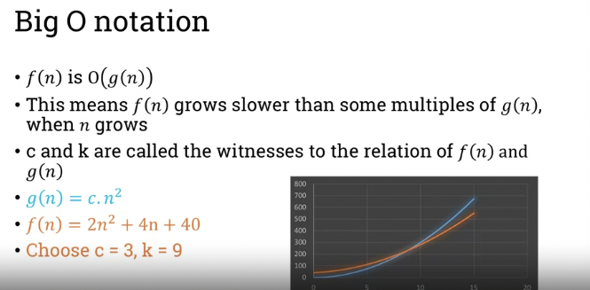

# Fundamentals of Computer Science

### Week 11 -

6.101 - Grammar

- grammar: set of rules for connecting string
- can represent languages that can't be accepted by FAs and RegEx
- Works reccursivly
- Context free gramar: - rules are indenpendent of context of the variable's occurance - 4 tuple - variables - V: finite set of symbols - terminals - Sigma : finite set of letters, disjoint from variables - Rules - R : mappings between variables and terminals - Start Var - S: member of V - variables can have mutliple rules : S-> bSa | ba

  6.201 Language of grammar

- format definitio: If G = (V, Sigma, R, S) then L(G) = {w $\in  \sum * $ | S $\rightarrow$ \*w}

example :
S -> bSa
S-> ba
strings such as ba, bbaa, bbbaaa can be derived
L(G1) = {bˆn aˆn | n >0}
G1 = (S, {a,b}, R, S), R = {S -> bSa, S -> ba}

6.203 designing a grammar

consistency : all generated strings by grammar fit description
comletness: all strings in description can be generated by the grammar
terminating recursion: all recursion in grammar will terminate

### Week 12 - Context-Free Languages: Part 2

6.301 regular expressions to context free languages

every regular language is context-free (TODO: define context free, define what regular means in regular language)
context-free languages can be generated by context free grammars
=> regular languages can be expressed by regular expressions

the reverse is not true, not all context free languages are regular

example:
convert ab\* to CFG

b* can be written as U -> bU|$\epsilon$
ab* can be written as S -> aU

CFG is
S --> aU
U --> bU|$\epsilon$

example 2:
union sign represents "or" so "|" can be used

ab*$\cup$b*

S --> aU | $\epsilon$
U --> bU|$\epsilon$

example 3:
convert ab+ $\cup$b+b

- sign means at least one occurance

b+ can be written as U -> bU|b
ab+ can be written as S -> aU
B+b can be writen as S -> bU

S -> aU | bU
U -> bU|b

example 4:
$\sum*$ a $\sum*$ $\sum$ = {a,b}

$\sum$ can be though of as $ (a\cup b)ˆ{b}$

starting with a : U --> aX , X $\in \sum$
starting with a : U --> bX , X $\in \sum$
emtpy string U -> $\epsilon$

U -> aU | bU | $\epsilon$

S -> UaU
Y -> U -> aU | bU | $\epsilon$

example 5:

$\sum\sum\sumˆ{+}$

$\sumˆ{+}$ = (a $\in$ b)ˆ+ or U -> aU|bU|b|a

V -> aU | bU
S -> aV | bV

6.304 Chomsky Normal Form
S -> XU
S -> a

This CFG is in normal form if:

- a is any terminal
- X, U and S are non terminals
- X & U are not the start variables
- S -> $\epsilon$ is permitted if S is the start varaiable

converting to chomskty normal

- add new start varaible $S_0$
- eliminate epsilein rrules

  6.305 Essential reading

Hopcroft, J., R. Motwani and J.D. Ullman Introduction to automata theory, languages and computation. (Harlow: Pearson Education Ltd, 2013) 3rd edition, Chapter 5, pp.171–224.

### Week 13 - Turing machines Part 1

7.203 Essential reading

Forbes, M. A theoretical introduction to Turing Machine. (World Technologies, 2014), Chapter 1, pp.4-21.

### Week 14 - Turing machines Part 2

7.304 Essential reading
Kozen, D.C. Automata and Computability. (New York: Springer, 2007), Lecture 32, pp.235–238.

### Week 15 - Algos I - Part 1

8.101 what are algos
set of steps required to complete a specific task

- what is the problem to solve?
- what is the input?
- what is the output that we expect?

  8.103 representing algos
  ordered, unambiguous set of exeecutable steps that form a terminating process

- ordered: at every step, the next step is clear (don't confuse with sequenential)
- unambiguoys: each operation is clear
- executable: each operation is doable (i.e: can't divide by 0)

Algorithm design technique

- divide and conquer: break problem into smaller sub-problems and combine the results (eg: multiplicatio)
- greedy: at each step of the algorithm choose the best solution step without considering the larger context (eg: network routing)
- backtracking: start with a solution at the current level and proceed to the next, if at next level the solution turns out to be erroneaous we go back to previous level and choose another candidate solution to try (eg: sudoku)

  8.201 insertion sort

basic logic:

1.  pick first item in unordred list
    - first item is already sorted agaisnt itself so start with second
2.  compare with previous items (ordered)
3.  move item if necessary

pseudocode representation

- i = 2
- while i is less than length of list - select ith entry as pivot - move pivot to temp position, leaving a "hole" in the array - while there is a item before the "hole" and item > pivot entry - move the item to the hole, moving the hole back in the array - move the pivot entry into the hole at its new position - i = i+1

  8.203 bubble sort

basic logic:move across array and compare two consecutive items, if previous is larger than next swap their positions. in each pass over the array, the largest non-sorted item reachs its sorted position in the end of the array (large elements bubble to the top)

pseudocopde representation

- end = length of array - 1
- while end > 1:
  - i = 1
  - while i < end:
    - if array[i]>array[i+1]
      - swapp array[i] and array[i+1]
    - i = i+1
  - end = end -1
- return list

8.204 Essential reading

Rosen, Kenneth; Rosen, Kenneth H. 2011 Discrete Mathematics and Its Applications 7th
ed McGraw-Hill US Higher Ed USE Legacy, Chapter 3.1, pp.191–204

### Week 16 - Algos I - Part 2

8.301 binary search

- If we have a sorted list, can we find an item in the list?
  - if a list is sorted, items before/after an element are smaller/greater than the element

basic logic: start at the middle of the list. if an item is smaller/bigger you only need to search the array on left/right side of the pivot. (we cut out search space in half).

- reccuresivly cut the search space in half

pseudocode:

- pivot = middle entry
- if pivot = search_item:
  - report success
- else if pivot>search_item:
  - list = items preceding pivot
  - run binary search on new sub list
- else: - list = items following pivot - run binary search on new sub list

  8.304 heap search

- use a datastructure called binarry tree
  - rooted tree where each not has no more than two children
- complete binary trees have exactly two children except the node in the bottom level
- they can be used to sort lists
  - this process is called heapyfing: the process of converting a complete binary tree into either max or min heaps
  - max heaps have nodes greater or equal to their children
  - vice versa for min heaps

heapify logic:

- start at lowest level, at the leftmost node with children
  - check if node is min heap, if not then swap positions of item to create a min heap
- move from left to right at each level before moving up to the next level higher in hierarchy
  - at end of first pass through tree, the smallest item is at the root of the tree
- we remove the root item and place it into a sorted list (initially empty and thus trivially sorted with one item).
- we take the lower item in the remaining strucutre (bottom right) and place it at the root of the tree (where the smallest item was previously)
- repeat process

TODO:

1. write pseudocode of heap sort
2. how many tree do we heapify?
3. how many swaps did we execute in each tree
4. what is the advantage of heap sort over insertion sort?

### Week 17 - Algos II - Part 1

9.101 recursion

- function that call themselves within the function body
- creates a call stack that will work on multiple layers, like and onion
  - will eventually run out of layers and work back up to the surface
- this will create a "call stack"

Euclid's Algorithm revisited:

- given two non-zeo intergers a&b find the greatest common divisor
- we assume GCD(a,b) = GCD(b,r) = GCD(a, r)
  - where r is the remainder in a /b
- by running the division one the arguments for GCD have decreased
  = b<= a, r<b
- we repeat the process untill r is =0 and b is the final GCD

pseudocode with loop

```python
def GCD(a,b):
    while b != 0:
        t = b
        b = a mod b
        a = t
    return a
```

pseudocode with recursion:

```python
def GCD(a,b):
    if b = 0:
        return a
    else:
        r = a mod b
        return GCD(b,r)
```

9.103 quicksort
basic logic:

- choose middle item as pivot
- reorder list so that items lesser are to left of array and items greater are to the right
  - at the end of this pass the pivot is in its correct place and never move again
- rerun the same process on the two sub arrays (left and right) reccuresivly

pseudocode:

- if list has 1 item:
  - return list
- else: - pivot = middle entry of list - delete pivot from list - for item in list: - if pivot >item: - ListLeft.append(item) - else: - ListRight.append(item) - return Quicksort(ListLeft) + pivot + quicksort(ListRight)

  9.201 merging lists
  How to merge two ordered lists and output a third list that i also ordered?

- treat them both as stack
  - compare the top of both stacks
  - the smaller element of the two is popped and appended to the third list
  - repeat untill both list are empty
- entire process executes 2N comparison (if each list has length of N)

pseudocode:

```bash
def Merge(A,B):
    while (A AND B have elements);
        if A[1] > B[1]:
            append B[1] to C
            remove B[1] from B
        else:
            append A[1] to C
            remove A[1] from A

    while (A has elements):
            append A[1] to C
            remove A[1] from A

    while (B has elements):
            append B[1] to C
            remove B[1] from B

    return C

```

9.203 merge sort

If we split an unordered list and do it untill reccuresivly untill we has N lists, each of 1 elements (trivially sorted). We can merge them back into a sorted array using the merge operation.

```bash
def MergeSort(List):
    N = length of List
    if N = 1:
        return List
    ListLeft = List[1 ... ceiling[N/2]]
    ListRight = List[ceiling[N/2] ... N ]
    ListLeft = MergeSort(ListLeft)
    ListRight = MergeSort(ListRight)
    return Merge(ListLeft, ListRight)
```


9.204 Essential reading

Rosen, Kenneth; Rosen, Kenneth H. 2011 Discrete Mathematics and Its Applications 7th
ed McGraw-Hill US Higher Ed USE Legacy, Chapter 5.4 Page 361-372.

### Week 18 - Algos II - Part 2

9.301 the algorithm of happiness

- Created by LLoyd Stowell Shapley (1923-2016)
  - Mathematician that worked on game theory and economics
  - 2012 Nobel Prize in Economics (jointly with Alvin Elliot Roth) for the theory of stable allocations and market design

We'll demonstrate stable matching using a problem

- there are N hospitals and N medical students
- Hospitals and students have ranked preferences (of whop they want to hire and where they want to work, respectvly)
- Pair hospitals and student so that the matcing is stable

TODO: define a stable match

Stable matching is when a student S preferes hospital H to the hospital that they got assigned while at the same time H preferes S to the student that they got assigned. They could make a side deal which make the pair unstable. Stable matching is a state with no unstable matches.


Definitions:

- Matching M is a set of pairs (h,s)
  - each hospital and student appears at most once in M
  - a matching is perfect if each hospital and student appears at least once

Gale Shapley Algo;

- All hospital make offers to their top preffered student
- Student with one offer accept the offer, student with multiple offers choose their preffered offer
- Repeat untill all hospitals are matched
  

  9.303 the gale shapely algorithm


### Week 19 - Complexity Theory - Part 1

10.101 Efficiency: Insertion sort

sequential search average case = average(1+2+3+....+n) = (1+2+3+..+n)/n = (n(n+1)/2)/n = (n+1)/2

insertion sort:

- best case: array already sorted: n-1 comparisions to sort 10 items
- worst case: array in reverse order: n(n-1)/2
- average case: n(n-1)/4

  1.103 Efficiency: bubble sort and binary search
  bubble sort

- best case: no swaps needed, already sorted: n-1 comparisons
- worst case: if items are in reverse order, the item at beggining of list is compared to n-1 then n-2 etc items
  - the new item at beggining of list will now be the largest untill we run n passes
  - n(n-1)/2 comparisons
- average case: Nˆ2

Binary searcg:

- beast case: item is in the middle --> constant time, 1 comparisons
- worst case: item is not in the array, search untill exaust all subarrays: log n
- avearge case: aprox log n

  10.201 asymptotic complexity
  some functions grow in different manners, they can be grouped into families of asymptotic behaviors (as n becomes very large) - we diregard smaller terms: 2nˆ+5n and 4nˆ2-7n both have same asymptotic behaviors

They are grouped into families

- constant
- linear
- logarithmic
- polynomails
- exponential

  10.203 big O notation

- f(n) an g(n) are two functions
- f(n) is O(g(n)) if there is a constant c and k such f(x) <= c \* g(x), x>k
- means: f will not exceed c \* g(x) after a certain x
  

### Week 20 - Complexity Theory - Part 2

10.301 recursion complexity

recursion: when functions are described byt their values for smaller inputs

master theorem: a method of modeling out reccurence relations.

$$ T(n) = aT(n/b) + O(nˆd)$$, a >= 1, b>1, d>=0 $$

d < log_bˆa --> T(n) = O(nˆlog_b a)

d = log_bˆa --> T(n) = O(nˆd \* logn)

d > log_bˆa --> T(n) = O(nˆd)


10.304 efficiency: quicksort, merge sort

quick sort:

- worst case: when the pivot is the largest/smallest value in the array. the right or left list is consistently empty
  - we have successivly (n-1)+(n-2)+..+2+1 comparisions
  - the sum is n(n-1)/2 comparisons
- average case: algo splits two lists of size i and (n-1-i)
  - T(n) = n + T(i) + T(n-i-1)
  - On average it is (1/n)(2*sigma(T(i)+n*n)) TODO: PROVE IT
  - T(n) = 2/n \* (T(n-1) + T(n-2)+..+T(0))+n
- best case: pivot is the median, divides list into two equal n/2 arrays
  - T(n) = 2T(n/2)+n
  - T(n) = 2T(2T(n/4)+n/2)+n = 4T(n/4)+2n
  - T(n) = 4T(2T(n/8)+n/4)+2n = 8T(n/8)+3n
  - T(n) .... = n + nlogn

merge sort: worst and best case have same asymptotic bounds

- worst/best case:
  - there are log(n) levels
  - each level has merging that takes O(n)
  - even if list is sorted we still have to read the items
  - T(n) = O(nlogn)
- average case:
  - we merge sort the two halves of the list
  - we have a constant factor for merging
  - T(n) = 2T(n/2) + cn --> O(nlogn)

10.305 Essential reading

Chang, S. (ed) Data structures and algorithms. (New Jersey: World Scientific Publishing, 2003), Chapters 8 and 9, pp.161–200.
