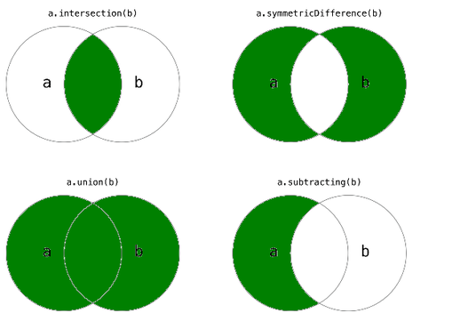
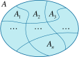

# CM 1020 - Discret Mathematics

**Discret Math** (DM) is a branch of mathematics that deal with distinct, separate values rather than continuous ones. It focuses on objects that can be counted/manipulated in a finite/coutable manner.

CM-1020 is organized around 10 DM topics:

1. Sets
2. Functions
3. Propositional Logic
4. Predicate Logic
5. Boolean Algebra
6. Induction & Recursion
7. Graphs
8. Trees
9. Relations
10. Combinatorics

## Topics 1: Sets

### Sets: Topic Objectives

The topic has the following learning objectives:

1. Understand set & powersets
2. Use the listing and rules of inclusion methods to construct sets
3. Manipulate set operations
4. Represent sets as Venn Diagrams
5. Understand and apply De Morgan's Law when negating expressions
6. Undertstand commutative, associative & distributive laws

### Sets: Definition

Sets are collections of distinct objects or elements grouped together based on common characteristics or properties.  
Each element within a set is considered unique, and sets themselves can be finite or infinite in size.

### Sets: Notation

There are three important concepts to define in sets: members, subsets & cardinality

- A set is composed of distinct element, e.g: $A=\{1,2,4,5,7\}$
- A set can be empty, e.g: $A=\emptyset$
- An item can either be a member of a set, or not, e.g: $1 \in A$ & $6 \notin A$
- Cardinality is the number of distinct elements in a set, e.g: $|A| = 5$
- A set can be subset of another set, if all its members are also members of another (bigger set). e.g: $B=\{1,3\}$ thus  
B is a subset of A or $B \subseteq A$

### Sets: Special Cases

Some sets are finite (the students of a class) while some are infinite (all possible integers). There are a few special  
sets that we should keep in mind

- Set of integers : $Z = \{...,-1,0,1,2,...\}$
- Set of positive integers : $N = Z^+ = \{1,2,3,4\}$
- Set of whole numbers : $W = \{0,1,2,...\}$
- Set of rational numbers : $Q = \{\frac{p}{q} | p,q \in Z \land q \neq 0\}$
- Set of real numbers : $R$

### Methods to Build Sets

We can either exasutivly list out the members of a set (listing method) or write an expression that defines the membership  
rules (set builder method). E.g: $A=\{1,2,3,4,5,6,7,8,9\}$ or $A=\{x | 0 < x < 10\}$

### Powersets

A powerset of a set is the set of all possible subsets of that set. For example, if $A = \{1,2,3\}$ then the powerset of A is  
$P(A)=\{\{\emptyset\}, \{1\}, \{2\}, \{3\}, \{1,2\}, \{2,3\},\{1,3\}, \{1,2,3\}\}$

The cardinality of a powerset is described with the formula $|P(A)|=2^{|A|}$ where $|A|$ is the cardinality of the orginal  
set $A$. In this case $|P(A)|=2^3=8$

### Set Operations

There are 4 set operations: Intersection ($\cap$), Union ($\cup$), Difference ($-$), Symetric Difference ($\otimes$)

- Intersection: the set of elements that appears in **BOTH** sets: $A \cap B = \{x | x \in A \land x \in B\}$
- Union: the set of elements that appears in **EITHER** sets: $A \cup B = \{x | x \in A \lor x \in B\}$
- Difference: the set of elements in the first set that **DONT** appear in the second $A - B = \{x | x \in A \land x \notin B\}$
- Symetric Difference: the set of element in **EITHER** sets but **NOT** in both $A \otimes B = \{x | (x \in \{A\cup B\}) \land (x \notin \{A\cap B\})\}$

### Set Complement

The complement of a set $A$ is all elements that belong to the universal $U$ set but not to the set $A$. It is noted as  
$\=A$ or $A'$. Formaly $\=A = \{x | x \in U \land x \notin A\}$

### De Morgan's Laws

De Morgan's law are a set of rules usefull in negating set expressions. They were formalized by Augustus de Morgan in the  
19th century.

- The complement of a union of two sets is the intersection of the complements of each of the two sets
  - $(A \cup B)' = A' \cap B'$
- The complement of an intersection of two sets is the union of the complement of each of the two sets
  - $(A \cap B)' = A' \cup B'$

This can be demonstrated using membership tables

| $A$ | $B$ | $A'$ | $B'$ | $A\cup B$ | $(A\cup B)'$ | $A'\cap B'$ | $A\cap B$ | $(A\cap B)'$ | $A'\cap B'$ |
|-----|-----|------|------|-----------|--------------|-------------|-----------|--------------|-------------|
| 0   | 0   | 1    | 1    | 0         | 1            | 1           | 0         | 1            | 1           |
| 0   | 1   | 1    | 0    | 1         | 0            | 1           | 0         | 1            | 0           |
| 1   | 0   | 0    | 1    | 1         | 0            | 1           | 0         | 1            | 0           |
| 1   | 1   | 0    | 0    | 1         | 0            | 0           | 1         | 0            | 0           |

### Commutative, Distributive & Associative Properties of Operators

The properties of sets are curcial in simplifying and manipulating expressions and equations using sets.

**Commutativity** is the property where the order of set involved in an operation does not affect the outcome

- Unions, intersection and symetric differences are commutative
  - $A \cup B = B \cup A$
  - $A \cap B = B \cap A$
  - $A \otimes B = B \otimes A$
- Differences are **NOT** commutative $A - B \ne B - A$
  - If $A = \{1,2\}$ & $B = \{1,3\}$ then $A-B=\{2\}$ & $B-A=\{3\}$

**Associativity** is the property where the order of the operations does not affect the outcome as long of the sequence of sets  
remains the same.

- Unions, intersection and symetric differences are assocaitive
  - $A \cup (B \cup C) = (A \cup B) \cup C$
  - $A \cap (B \cap C) = (A \cap B) \cap C$
  - $A \otimes (B \otimes C) = (A \otimes B) \otimes C$
- Differences are **NOT** associative  $A - (B - C) \ne (A - B) - C$
  - If $A = \{1,2\}$, $B = \{1,3\}$ & $C = \{2,3\}$ then:
    - $A - (B - C) = \{1, 2\} - \{2\} = \{2\}$
    - $(A - B) - C = \{2\} - \{2, 3\} = \emptyset$

**Distributivity**  is the property where one operation can be distributed over another operation, combining the elements in a way  
that maintains the equivalence.

- Intersection over union: $A \cap (B \cup C) = (A \cap B) \cup (A \cap C)$
- Union over intersection: $A \cup (B \cap C) = (A \cup B) \cap (A \cup C)$

### Set Partitions

A paritioning of a set is enumerating a set of subsets that collectivly contain all the elements of the original set but  
have no overlap among them.

Formally we have $A_1 \cup A_2 \cup ... A_n = A$ and $A_i \cap A_j = \emptyset$ for all $i \ne j$ and $i,j \in [1..n]$

